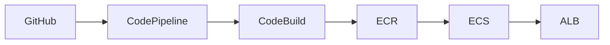

# **Spring Boot AWS ECS Deployment Pipeline**  
**A CI/CD pipeline for containerized Spring Boot applications on AWS Fargate**

This project demonstrates a complete infrastructure-as-code solution for deploying Spring Boot applications to AWS using:  
- **AWS ECS Fargate** (serverless containers)  
- **AWS CodePipeline** (CI/CD automation)  
- **AWS CodeBuild** (build/test)  
- **Amazon ECR** (Docker image storage)   

## **Key Features**  
✅ **Automated deployments** triggered by GitHub commits  
✅ **Dockerized** Spring Boot application with multi-stage builds 
✅ **Blue-green deployment** readiness  
✅ **Health checks** and monitoring integration  

## **Architecture**  

## **Technology Stack**  
- **Backend**: Spring Boot 3.x (Java 17)  
- **Infra**: AWS ECS, Fargate, CodePipeline  
- **Tools**: Docker, Maven, AWS CLI  

---

### **Why This Project?**  
This template solves common challenges when deploying Java apps to AWS:  
- Proper container naming conventions  
- ECR authentication in pipelines  
- IAM permission best practices  
- Zero-downtime deployment patterns  

---

This description:  
1. Explains **what** the project does  
2. Highlights **key technologies**  
3. Provides **visual architecture**  
4. Includes **quick start** instructions  
5. Positions it as a **reference solution**  
